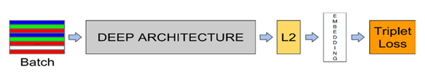

# face_attendance

## 개요
### 내용
- 단체 사진 업로드를 통해 자동으로 출결 체크를 해주는 시스템

### 목적
- 기존 출결 방식에는 전자 출결 방식과 직접 호명 방식이 있다. 전자 출결 방식의 경우, 단말기 설치를 통해 사용자가 직접 RFID칩을 인식 시켜야 하는데, 단말기 설치를 강의실마다 해야 하고, 대리 출석의 문제를 야기시킬 수 있다. 직접 호명 방식의 경우, 대규모 강의일 경우 인원이 많기 때문에 일일이 학생을 호명할 때 어려움이 있다. 이에, 단체 사진을 통한 빠르고 간편한 자동 출결 체크 시스템을 고안하게 되었다.

### 기대효과
- 기존의 출결 관리 방식은 강의시간을 지연시키고 대리 출석을 하거나 출석이 누락되는 문제점을 가지고 있었다. 또한, 전자 출결의 방식에도 별도의 단말기가 필요하고 카드나 개인기기를 지참하지 않았을 경우 출석이 불가하다는 문제점을 가진다. 따라서 우리는 얼굴 인식을 통한 빠른 출석체크가 이루어지도록 하여 강의시간이 지체되는 것을 최소화하고 별도의 기기를 필요로 하지 않아 추가 비용이 소모되지 않는 장점을 가질 것으로 예상하고 있다.

## 아키텍처 및 다이어그램
  

## 사용 시나리오
  

## 구현 기능 및 알고리즘 : 3가지 기능으로 시스템 동작
- 얼굴 인식 (RetinaFace) : 얼굴의 위치 5가지 (양 눈의 중심점, 코 끝, 두 입꼬리)
- 특징 추출 (FaceNet) : 128차원 임베딩 벡터를 직접적으로 학습
  - triplet loss 함수 사용 (첫번째와 두번째 임베딩 벡터 사이 거리는 가깝게, 첫번째와 세번째 임베딩 벡터 사이 거리는 멀게 학습)
  - deep convolution network (합성공 신경망 CNN)
  
 
## 작동 방식
1. 로그인 (Secure hash Algorithm)
2. 강의 추가 (이름 학번 추가 > DB Course 테이블에 교수id추가 > Coures_student 테이블에 학생 id, 강의 id 추가 > attendance_check 테이블에 강의 id, 학생id 추가하여 15주에 해당하는 출석 여부 생성)
3. 강의 목록
4. 출석표 (출력)
5. 출석확인
